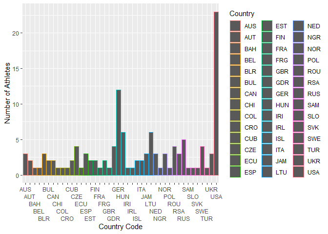

Discus Analysis
================

``` r
#imports
library(readr)
library(tidyverse)
```

    ## ── Attaching packages ─────────────────────────────────────── tidyverse 1.3.2 ──
    ## ✔ ggplot2 3.4.0      ✔ dplyr   1.0.10
    ## ✔ tibble  3.1.8      ✔ stringr 1.5.0 
    ## ✔ tidyr   1.2.1      ✔ forcats 0.5.2 
    ## ✔ purrr   1.0.0      
    ## ── Conflicts ────────────────────────────────────────── tidyverse_conflicts() ──
    ## ✖ dplyr::filter() masks stats::filter()
    ## ✖ dplyr::lag()    masks stats::lag()

``` r
#Importing and assigning our data to a dataframe
MensDiscUnformatted <- read.table("TrackDiscusData.txt", sep = "%", quote="\"")

#Breaking up our condensed dataframe into it's respective columns
MensDisc <- tidyr::separate(MensDiscUnformatted, V1,
                         c("Empty", "Rank", "Distance", "Name", "Country", "Birthdate", "Worthless", "Location", "Date"),
                         sep = "\\s{2,}", ) %>%
  select(-Empty)
```

Shown above is the importing of our plain text data, notice the
quote=“"” which accounts for the apostrophes in the plain text which
would mess up the data frame if not for this argument

``` r
#imports
library(forcats)

#Creating a dataframe with just countries and the number of athletes that came out of them
basicCountry <- MensDisc %>% distinct(Name, .keep_all = TRUE) %>% count(Country, sort = TRUE)

#Creating our barplot
ggplot(basicCountry, aes(x = fct_reorder(Country, n), y = n, color = "pink")) + 
  geom_col() +
  scale_x_discrete(guide = guide_axis(n.dodge = 5)) +
  labs(y= "Number of Athletes", x = "Country Code") + 
  coord_flip() + 
  theme(legend.position="none")
```

<!-- --> This is a plot
just to get a vague idea of what countries are producing the most
winning athletes. It is clear that the US and Germany are far beyond the
rest of the countries. With some other European states still having
multiple athletes, but not as significant of a number as Germany or the
US.

It is important to note that this is a generally small list of athletes
so it should be kept in mind that there could be a lot of variance just
caused simply by the small size of the dataset.

``` r
#imports
library(lubridate)
```

    ## Loading required package: timechange

    ## 
    ## Attaching package: 'lubridate'

    ## The following objects are masked from 'package:base':
    ## 
    ##     date, intersect, setdiff, union

``` r
ForOther <- MensDisc %>% mutate(Year = substr(Date,7,10))
Bday   <-parse_date_time2(ForOther$Birthdate, "dmy", cutoff_2000 = 15)
Rday <-parse_date_time2(ForOther$Date, "dmY", cutoff_2000 = 20)
Dif <-difftime(Rday, Bday, units = "weeks")
Please <- as.integer(Dif/52)
New <- ForOther %>% 
  mutate(NewCol = Please)

#Creating a scatterplot of our athletes age's and the distances they threw at that age
ggplot(New, aes(x=NewCol, y=as.numeric(Distance))) +
  geom_point(alpha=0.1) +
  labs(y= "Distance", x = "Age")
```

<!-- -->

Now that we have the graph we can see that men are most likely to
perform at their BEST when between the ages of 25 to 28. However as we
can there are still men almost a decade older who are still performing
at a very high level. It is also interesting to know that athletes on
the younger end of age spectrum 18-20 just don’t seem to be able to hit
the distances that men in their mid 20’s are. Even more curious is the
fact that these young men are being matched and sometimes outperformed
by men almost double their age.

``` r
#Imports
library(rgeos)
```

    ## Loading required package: sp

    ## rgeos version: 0.6-1, (SVN revision 692)
    ##  GEOS runtime version: 3.9.3-CAPI-1.14.3 
    ##  Please note that rgeos will be retired during 2023,
    ## plan transition to sf functions using GEOS at your earliest convenience.
    ##  GEOS using OverlayNG
    ##  Linking to sp version: 1.5-1 
    ##  Polygon checking: TRUE

``` r
library(sf)
```

    ## Linking to GEOS 3.9.3, GDAL 3.5.2, PROJ 8.2.1; sf_use_s2() is TRUE

``` r
library(countrycode)

#Importing country coordinates
mapData <- map_data("world")
#Converting country codes to country names to match with the coordinate vector
forMap <-basicCountry %>% mutate(region = countrycode(basicCountry$Country,"ioc","country.name")) 
```

    ## Warning in countrycode_convert(sourcevar = sourcevar, origin = origin, destination = dest, : Some values were not matched unambiguously: FRG, GDR

``` r
#Accounting for east and west germany not being covered by Countrycode library
forMap[is.na(forMap)] <- "Germany"

#Combining the coordinate dataframe with our main dataframe by region 
mapData <- left_join(mapData, forMap, by="region")

#Getting rid of extra countries out of new frame
mapData1 <- mapData %>% filter(!is.na(mapData$n))
#Removing non European countries from the new frame
mapData2<-mapData1[!(mapData1$region=="United States" | mapData1$region=="Jamaica" | mapData1$region=="South Africa" | mapData1$region=="Cuba" | mapData1$region=="Bahamas" | mapData1$region=="Chile" | mapData1$region=="Ecuador" | mapData1$region=="Iran" | mapData1$region=="Nigeria" | mapData1$region=="Australia" | mapData1$region=="Canada" | mapData1$region=="Colombia"),]
 

#Making the map
map1 <- ggplot(mapData2, aes(x = long, y = lat, group=group)) + 
  geom_polygon(aes(fill = n), color="black") +
  coord_sf(xlim = c(-25,50), ylim = c(35,70), expand = FALSE) +
  scale_fill_gradient(name = "Number of Athletes", low = "yellow", high = "red", na.value="grey50")

map1
```

<!-- -->

The purpose behind this visualization was to explore whether there was
any potential correlation between the location of the European countries
producing the most athletes however as we can see there seems to be no
evident pattern. However we do have a very limited number of athletes
from each country so if there was more data some kind of pattern could
potentially become more evident.

If I were to look further into this issue I would try and investigate
the GDP of each athletes corresponding country (In the year of their
record setting performance) and see if a nations wealth is a potential
indicator for success at discus
